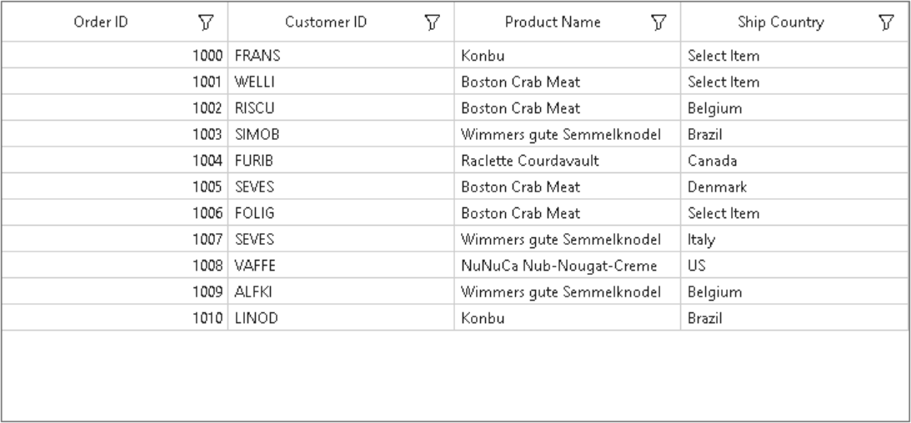

# How to Set the Default Display Text for GridComboBoxColumn in WinForms DataGrid?

This sample illustrates how to set the default display text for [GridComboBoxColumn](https://help.syncfusion.com/cr/windowsforms/Syncfusion.WinForms.DataGrid.GridComboBoxColumn.html) in [WinForms DataGrid](https://www.syncfusion.com/winforms-ui-controls/datagrid) (SfDataGrid).

In `DataGrid`, `GridComboBoxColumn` does not have direct support to display default text on it when there is no selected Item. You can change default text using [SfDataGrid.DrawCell](https://help.syncfusion.com/cr/windowsforms/Syncfusion.WinForms.DataGrid.SfDataGrid.html#Syncfusion_WinForms_DataGrid_SfDataGrid_DrawCell) event.

```c#
this.sfDataGrid.DrawCell += SfDataGrid_DrawCell;

private void SfDataGrid_DrawCell(object sender, Syncfusion.WinForms.DataGrid.Events.DrawCellEventArgs e)
{
    if(e.Column.MappingName == "ShipCountry" && string.IsNullOrEmpty(e.DisplayText))
    {
        e.DisplayText = "Select Item";
    }
}
```



## Requirements to run the demo
 Visual Studio 2015 and above versions